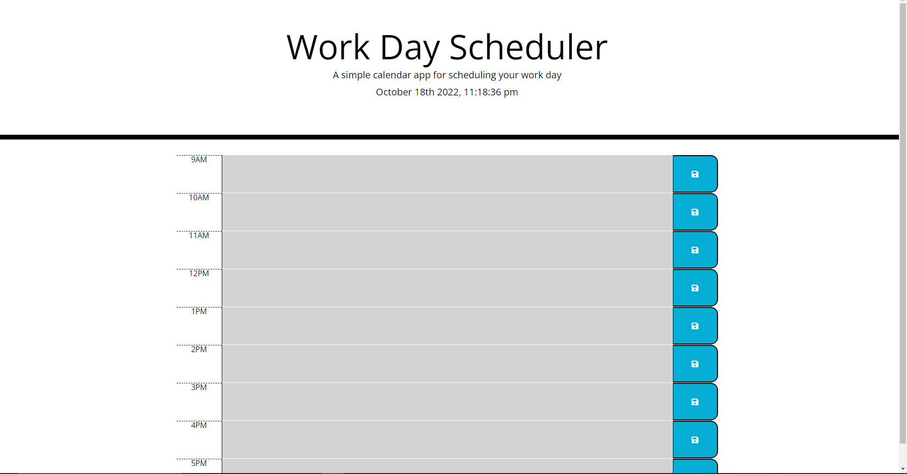

# work-scheduler
This is a application is for keeping track of a 9 to 5 schedule on a daily basis
you can leave a note for each hour in this time frame. If a section is greyed out, it means that, that hour has past. Red means that its that exact hour currently, and green means the hour hasnt happend yet
# Photo of app

# Link to deployed application 
<link href="https://connorg24.github.io/work-scheduler/">